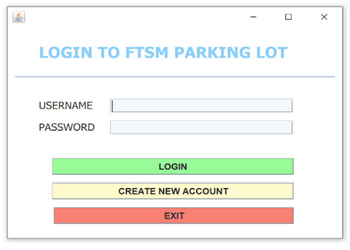
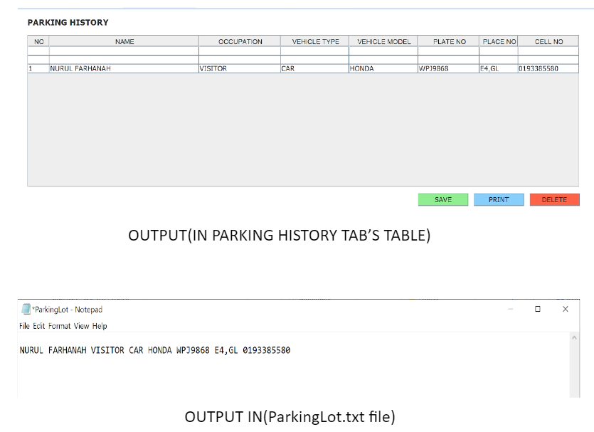

# Overview
This is a system for vehicle registration in FTSM. Users can register vehicles, park vehicles, and appoint staff to management staff. Users also can control the information that is keyed in the system and save them in files.

# Features
1. Login:
   - Login into this system by username and password.
   - For new users, there’s a button “CREATE NEW ACCOUNT” where they can create a new account.
2. Create New Account:
   - Add Personal Info & Login Info
3. Park Vehicle:
   - User can park vehicles in any spots available and in parking lot type: General, Motorcycle, Staff, or Management Staff.
   - Different parking lot types only accept specific vehicle types and occupations such as stated below:
       Car Parking Lot: Any occupation is acceptable. Won’t accept motorcycle, bus, and lorry.
       Motorcycle Parking Lot: Any occupation is acceptable. Won’t accept anything other than motorcycle.
       Staff Parking Lot: only accept Staff and Car.
       Management Parking Lot: only accept Management Staff, car, and motorcycle.
   - Fill in the information to assign the owner to the parking spot chosen.
4. Register Vehicle:
   - Register vehicles and personal info in order for the vehicle to be able to park in FTSM.
5. Parking History:
   - A table of previous information that is keyed in by user who had their vehicles parked in FTSM.
6. Registration History:
   - A table of information on users who had registered their vehicles in the system.
7. Appoint Staff:
   - To appoint staff to management staff.

# Platform
- Developed using Java, Eclipse.

# Snippets of this project

<table>
     <tr>
         <td></td>
     </tr>
      <tr>
         <td></td>
      </tr>
      <tr>
         <td></td>
      </tr>
      <tr>
         <td></td>
      </tr>
      <tr>
         <td></td>
      </tr>
      <tr>
         <td></td>
      </tr> 
      <tr>
         <td></td>
      </tr>
      <tr>
         <td></td>
      </tr>
      <tr>
         <td></td>
      </tr>
</table>

# Weaknesses
1. User might get confused regarding the reset button in PARK VEHICLE tab. If they reset the wrong button, it can lead to multiple vehicles being parked at the same spot. 
2. Both tables in PARKING HISTORY and REGISTRATION HISTORY tabs are easily editable which can cause some information to be altered.
3. Both tables in PARKING HISTORY and REGISTRATION HISTORY tabs don’t keep the information that is added in for too long. Especially when you change parking lot types and then go back to the table. However, you can still see the saved information in the file ParkingLot.txt and Regiter.txt.
